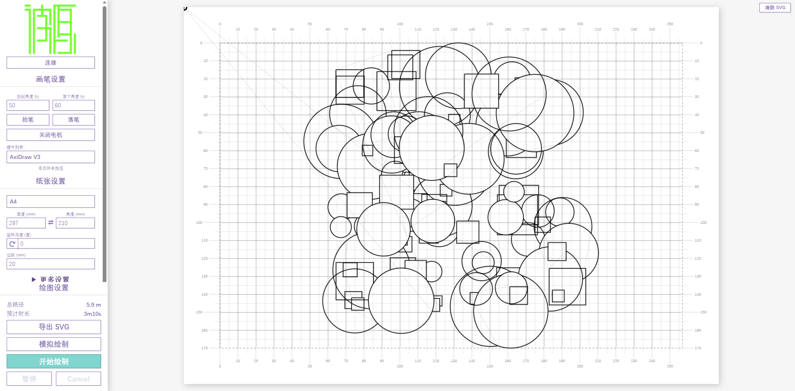

# Bit2AtomBot

> 基于 Web 的 AxiDraw 笔式绘图仪控制系统 —— 在开源项目 SAXI 基础上深度改造

---

## 📋 项目定位

Bit2AtomBot 是一款专为 **AxiDraw 系列笔式绘图仪**设计的现代化 Web 控制端。它提供了更直观的操作界面、更丰富的硬件适配能力和更流畅的用户体验。


<details>
<summary>旧版界面</summary>



</details>

项目将绘图仪的控制从传统的桌面端（Inkscape 插件）解放出来，通过浏览器即可完成从 SVG 加载、路径预览、参数调整到设备驱动的全流程操作。

---

## 🧬 与 SAXI 的关系（借鉴与深度改造）

本项目以开源项目 [SAXI](https://github.com/alexrudd2/saxi)（AGPL-3.0）为基础进行深度改造。SAXI 提供了优秀的整体框架——本项目**完整保留**该框架，并针对实际绘图使用中的真实痛点做了系统性的功能扩展与工程化改造。

### 继承自 SAXI 的基础能力

以下核心能力来自 SAXI 框架，本项目保留并按需增强：

- **整体架构**：Express + WebSocket 服务端、React 预览界面、双驱动模式（服务端远程控制 / WebSerial 浏览器直连）
- **EBB 串口协议层**：LM（低层恒加速）/ XM（高层匀速）指令按固件版本自适应，运动指令 FIFO 深度管理
- **恒加速度运动规划**：梯形/三角形速度曲线，拐角速度优化
- **路径预处理**：路径排序（最小化抬笔空跑）、路径合并、短路径过滤、去重点
- **其他**：纸张尺寸体系、按颜色/图层分层控制、无硬件模拟绘制、CLI 批处理、Web Worker 后台规划

### 深度改造：SAXI vs Bit2AtomBot

| 改进维度 | SAXI | Bit2AtomBot |
| --- | --- | --- |
| **渲染正确性** | SVG transform 被静默丢弃（`getCTM()` 在未挂载 DOM 时失效），设计软件导出图形比例失真 | ✅ **transform 完整支持**：自研矩阵引擎，6 种变换函数任意深度复合，与浏览器原生结果精度一致（1e-9） |
| **绘制容错** | 仅暂停/继续，漏画只能整图废弃重画 | ✅ **暂停回溯重绘 + 区间补画**：绘制中回溯到任意路径重画；绘制结束后按区间补画，红色标记保留供质量检查 |
| **归位可靠性** | 依赖 EBB `HM` 命令（在补画的电机关-开循环后会误判原点成为空操作） | ✅ **归位全流程加固**：基于应用层位置的抬笔行程归位、通信探活 + 队列清空重试、全命令超时、分步耗时统计 |
| **断连保护** | 设备拔出时挂起命令无处理，易卡死 | ✅ 断连立即中止挂起命令并退出绘制状态 |
| **绘制质量** | 无隐藏线处理 | ✅ **隐藏线去除**：自动裁剪填充图形后方的线条，模拟真实遮挡（源自 AxiDraw 官方扩展思路） |
| **成果输出** | 无 | ✅ **SVG 导出**：路径优化 + 隐藏线去除后的"所见即所得"成果文件 |
| **硬件适配** | 固定 3 款预设，`stepsPerMm` 硬编码 | ✅ **自定义传动参数**：步距角/细分/齿数/齿距实时换算，适配自制绘图仪，配置持久化 |
| **运行依赖** | 内置 svg.io 云端生图（需 API Key、外网） | ✅ **移除云端依赖**，纯本地运行，无隐私外传 |
| **界面体验** | 英文界面 | ✅ 全中文界面、暗色主题、网格标尺、实时进度统计 |
| **质量保障** | 20 个测试用例 | ✅ 34 个测试用例（回溯/补画归位专项测试）+ lint 零告警 |

### 代码规模变化

| 模块 | SAXI | 本项目 | 增量 |
| --- | ---: | ---: | --- |
| ui.tsx（界面） | 1304 行 | 1873 行 | +44%（回溯控制/着色/网格标尺/硬件配置/导出） |
| planning.ts（运动规划） | 675 行 | 769 行 | +94 行（回溯核心算法 + 自定义传动参数） |
| hiding.ts（隐藏线去除） | — | 181 行 | **新增** |
| export-svg.ts（SVG 导出） | — | 68 行 | **新增** |
| rewind.test.ts（回溯测试） | — | 6 用例 | **新增** |

> 完整的技术分析（回溯算法实现、EBB `EM`/`HM` 固件行为、接口变更对照、独有功能价值分析）见 [TECHNICAL_REPORT.md](TECHNICAL_REPORT.md)。

---

## 功能特性

### 核心绘图功能

- **SVG 拖放加载** — 拖入或粘贴 SVG 文件，自动解析并展平路径
- **SVG transform 完整支持** — 自动解析并复合 `<g>`/`<path>` 等元素上的全部变换函数（`matrix`/`translate`/`scale`/`rotate`/`skewX`/`skewY`），支持任意深度嵌套。Affinity Designer 等软件导出的含 `transform` 的 SVG（如非等比缩放图形）可直接正确渲染，无需预先用 Inkscape 或脚本烘焙变换。矩阵计算结果与浏览器原生 `getCTM()` 逐项一致（精度 1e-9）
  - 已知限制：不支持 `<use>`/`<defs>` 引用间接展开；嵌套 `<svg>` 的 `x/y/width/height` 视口设置按 `<g>` 处理
- **实时路径预览** — 在纸张模拟区域内预览绘制路径，支持按绘制顺序着色
- **暂停回溯重绘** — 绘制中途可随时暂停；暂停后可拖动滑块回溯到之前任意一条路径，预览中以橙色高亮从回溯点到暂停点的全部待重绘线条（已重绘部分转为红色），确认后绘图仪会抬笔安全移动到回溯点并从该处重绘后续内容。绘制完成后界面保持完成任务状态，红色重绘标记持续保留（直到开始新绘制/取消/清除 SVG），便于检查重复绘制区域的最终质量。适用于笔出墨不畅导致漏画的情况，无需废弃整幅画
- **网格与标尺** — 绘制区域以 5mm/10mm 浅色方格打底，四周带刻度标尺，便于观察坐标
- **隐藏线去除** — 自动裁剪填充图形（如圆形、矩形）后方的线条，模拟真实遮挡效果
- **完整运动规划** — 恒加速度梯形/三角形速度曲线，拐角速度优化
- **路径优化** — 路径排序（最小化抬笔空跑）、路径合并、短路径过滤、去重点
- **图层控制** — 按 stroke 颜色或 group ID 自动分层，可选择特定图层绘制
- **缩放适配** — 自动缩放并居中适配纸张，或手动裁剪至边距
- **清除 SVG** — 预览区域右上角一键清除当前加载的 SVG 文件，方便更换文件
- **SVG 导出** — 将经过路径优化和隐藏线去除后的结果导出为 SVG 文件（仅含落笔绘制路径）

### 暂停回溯重绘（漏画补救）

绘制过程中若因笔出墨不畅导致漏画，无需废弃整幅画，可按以下步骤补救：

1. **暂停** — 发现漏画时点击「暂停」，绘图仪会在当前笔画结束（抬笔状态）后停下
2. **选择回溯点** — 暂停后出现回溯控制条，拖动滑块回溯到之前任意一条路径；预览中以**橙色**高亮将被重绘的线条范围
3. **重绘继续** — 点击「从第 X 条路径重绘并继续」，绘图仪会抬笔安全移动到回溯点，从该处重新绘制后续所有内容；重绘过程中线条随进度**由橙色变为红色**
4. **再次回溯** — 重绘过程中仍可再次暂停并回溯，**支持连续多次回溯操作**（例如第一次回溯位置选早了，可再次暂停修正）

不需要重绘时，点「继续（原位）」可从暂停处直接继续，不触发重绘。

绘制完成后，所有被重绘过的区域仍以**红色**保留显示，其余区域为正常颜色，方便用户对照检查这些区域的最终绘制质量。

**完成后不自动复位**：绘制完成后界面保持「已完成任务」的状态展示（包括红色重绘标记），不会自动转入新的等待绘制状态。只有当用户点击「开始绘制」开始新任务、或取消绘制、或清除 SVG 时，红色标记才复位。这样用户有充足时间对照预览检查重复绘制区域的实际效果。

说明：

- 进度条同时显示百分比和「路径 X / Y」计数，实时了解绘制进度
- 回溯区间覆盖**从回溯点到暂停点的全部路径**：暂停选择回溯点时，该区间内所有待重绘线条均以橙色高亮显示（不只是单条路径）
- 多次回溯时各次重绘区间会**叠加记录**，所有被重绘过的区域最终都会以红色显示
- 回溯以**路径**为最小单位（对齐到路径起始的抬笔移动），保证恢复点总是安全静止起步
- 重绘为覆盖式重画：回溯点之后的线条会画两遍（原有 + 重绘），对出墨漏画场景这正是补墨的预期效果
- 服务端模式和 WebSerial 直连模式均支持

### 补画模式（绘制结束后区间补画）

整幅绘制结束后发现某些区域漏画？无需重画全图，使用「补画模式」只重绘选中的路径区间：

1. **进入补画模式** — 绘制结束（或取消）后，点击「补画模式…」按钮
2. **选择区间** — 拖动**起点/终点双滑块**选择要补画的路径范围（如第 3 至第 7 条）；预览中以**橙色**高亮选中区间，可与纸上实际绘制结果对照确认
3. **执行补画** — 点击「补画选中区间」，绘图仪会抬笔安全移动到区间起点，仅重绘该区间的路径；补画过程中线条随进度由橙色变为红色，完成后红色标记保留，并**自动抬笔回到起始点**（方便取纸检查）

注意事项：

- 补画以**路径**为最小单位，起点自动对齐到路径起始的抬笔移动，保证安全静止起步
- 系统会自动跟踪笔的位置以规划安全移动路径，且每次补画完成后自动归位，通常无需手动干预；仅当笔位置未知时（如服务重启过），才需先点击**「笔回原点」**再补画
- **归位可靠性**：归位采用基于已知位置的抬笔行程移动（而非 EBB 的 `HM` 命令，后者在补画的电机关-开循环后会误判原点）；归位前自动探测通信状态，队列卡死时自动清空重试；所有命令均有超时保护，失败时界面弹窗提示，点击**「笔回原点」**即可重试
- **断连保护**（浏览器直连模式）：绘制中拔出 USB 或串口断开时，系统立即中止挂起的命令并退出绘制状态（弹窗提示「设备已断开连接」），不会卡在"绘制中/暂停中"；重新连接后请先执行**「笔回原点」**恢复位置跟踪
- **性能监控**：服务端日志输出每次归位的总耗时与分步耗时（`Home: done in 12.3s (probe 0.1s, pen 1.0s, ..., travel 9.8s, ...)`），若 travel 段耗时持续变长，提示机械阻力增大或通信退化，可作为硬件健康参考
- 补画前请勿修改规划选项或重新加载 SVG（会导致区间编号与实际笔迹不对应）；界面会在检测到不一致时提醒确认
- 补画区间可多次叠加执行，所有补画过的区域均以红色标记保留，直至开始新绘制或清除 SVG
- 服务端模式和 WebSerial 直连模式均支持

### 传动参数（高级功能）

- **自定义硬件配置** — 支持用户创建并保存命名硬件配置
- **步进电机参数**：
  - 步距角（°）：支持 1.8°、0.9° 等
  - 驱动细分：16、32、64 等
  - 同步轮齿数：20、18、16 等
  - 同步带齿距（mm）：2（GT2）等
- **实时计算** — 自动计算 `stepsPerMm` 和 `微步值`
- **预设硬件**：AxiDraw V3 / Brushless / NextDraw 2234 / iDraw H SE

### 交互相应

- **全中文界面** — 所有操作面板完全中文化
- **实时进度跟踪** — 绘制进度条 + 百分比显示
- **预计时长与剩余时间** — 自动估算绘制时间
- **总路径统计** — 实时显示走笔总路程
- **暂停/继续/取消** — 绘制和模拟过程中可随时控制
- **硬件选择** — 未连接设备时也可随时调整硬件型号或创建自定义配置（下拉框始终启用）
- **暗色模式** — 在「更多设置」中切换浅色/暗色主题，持久化偏好设置

### 设备驱动

- **双模式架构**：
  - **服务端模式**（默认）：Express + WebSocket + NodeSerialPort
  - **WebSerial 模式**：浏览器直接控制（`IS_WEB=1`）
- **多硬件支持**：AxiDraw V3 / Brushless / NextDraw 2234 / iDraw H SE
- **EBB 固件自适应**：自动检测固件版本，选择 LM（低层恒加速）或 XM（高层匀速）指令

### 模拟绘制

- **无需硬件** — 未连接设备时也可用
- **真实速度** — 按照实际运动规划的速度曲线逐动作推进
- **进度可视化** — 十字准星沿路径实时移动，进度条同步更新百分比
- **随时停止** — 模拟过程中可点击「停止模拟」结束

---

## 独特性与价值

### 对比传统方案

| 维度     | Inkscape + AxiDraw 插件   | Bit2AtomBot                          |
| -------- | ------------------------- | ------------------------------------ |
| 依赖     | 需安装 Inkscape + X11     | 只需浏览器 + Node.js                 |
| 启动速度 | 慢（Inkscape 启动耗时长） | 极快（毫秒级启动）                   |
| 远程控制 | 需 VNC/RDP                | 浏览器直接访问                       |
| 自动化   | 不支持                    | 支持 CLI 批处理                      |
| 运动规划 | 基础                      | 恒加速度 + 拐角优化                  |
| 硬件兼容 | 单一硬件                  | 多预设 + 自定义硬件                  |
| 参数可调 | 有限                      | 全参数可调（加速度/速度/转弯系数等） |
| 平台兼容 | Linux/macOS 优先          | Windows/macOS/Linux                  |

### 核心价值

1. **无需桌面软件** — 浏览器即控制台，树莓派 Zero 也能流畅运行
2. **远程操控** — 局域网内任何设备（手机/平板/笔记本）均可控制
3. **低门槛** — 拖入 SVG 点击绘制，3 步完成
4. **硬件灵活** — 支持自定义传动参数，适配不同步进电机与同步带配置
5. **自动化友好** — 命令行批处理模式，可集成到自动化流水线
6. **开源透明** — AGPL-3.0 协议，可自由审查和修改

---

## 运行环境

### 硬件要求

- 任意 AxiDraw 系列绘图仪（V3 / Brushless / NextDraw 2234 / iDraw H SE）
- 或兼容 EBB 固件的绘图仪

### 软件要求

| 依赖    | 版本要求                | 说明              |
| ------- | ----------------------- | ----------------- |
| Node.js | >= 20.0.0               | JavaScript 运行时 |
| npm     | >= 9.x                  | 包管理器          |
| 浏览器  | Chrome / Edge / Firefox | 任意现代浏览器    |

### 支持平台

- ✅ Windows 10/11
- ✅ macOS
- ✅ Linux（含树莓派全系列）

---

## 启动方法

### 首次运行

```bash
# 1. 进入项目目录
cd Bit2AtomPlotWebUI

# 2. 安装依赖
npm install

# 3. 完整构建（服务器 + 前端）
npm run build:server
npm run build:ui

# 4. 启动服务
node cli.mjs
```

### 日常启动

```bash
# 方式一：全流程（lint → 构建 → 启动）
npm start

# 方式二：快速启动（跳过构建，代码无变化时使用）
node cli.mjs
```

### 启动后

浏览器打开 **http://localhost:9080**

### 常用命令

| 命令                   | 说明                   |
| ---------------------- | ---------------------- |
| `npm start`            | 完整构建 + 启动        |
| `node cli.mjs`         | 直接启动（不重新构建） |
| `npm run build:server` | 仅编译服务器端         |
| `npm run build:ui`     | 仅编译前端 UI          |
| `npm run build`        | 构建服务器 + 前端      |
| `npm run lint`         | 代码静态检查（biome，当前 0 告警） |
| `npm test`             | 运行测试套件（vitest，34 个用例） |

### 运行日志

服务端每次启动自动将日志写入 `logs/bit2atombot-<日期>-<时间>.log`（终端输出同步保留），每行带本地时间戳与级别标记，包含绘制/补画耗时、归位分步耗时（probe/pen/motors/travel/idle/disable）、通信探活等性能数据，便于事后分析评估。自动保留最近 50 个日志文件。

```bash
# 自定义日志目录（默认 logs/）
set BIT2ATOM_LOG_DIR=D:\plotter-logs && node cli.mjs

# 禁用文件日志（仅终端输出）
set BIT2ATOM_NO_FILE_LOG=1 && node cli.mjs
```

### 端口冲突处理

```bash
# 杀掉所有 Node 进程后重启
taskkill /f /im node.exe
node cli.mjs
```

---

## 项目结构

```
bit2atom-main/
├── tools/
│   ├── safe-edit.ps1              # PowerShell UTF-8 安全编辑函数
│   └── file-edit.py               # Python UTF-8 安全编辑工具
├── test-hidden-line.svg            # 隐藏线去除测试文件
├── cli.mjs                  # CLI 入口
├── build.mjs                # 前端构建脚本
├── package.json             # 项目配置
├── tsconfig*.json           # TypeScript 配置
├── biome.json               # 代码检查配置
├── src/
│   ├── ui.tsx               # React UI 组件（主界面）
│   ├── server.ts            # Express 服务器
│   ├── cli.ts               # CLI 参数解析
│   ├── ebb.ts               # EBB 电机控制协议
│   ├── planning.ts          # 运动规划内核
│   ├── massager.ts          # 路径预处理
│   ├── drivers.ts           # 驱动抽象层
│   ├── util.ts              # 工具函数
│   ├── vec.ts               # 2D 向量运算
│   ├── paper-size.ts        # 纸张尺寸定义
│   ├── style.css            # 界面样式
│   ├── index.html           # HTML 模板
│   └── icons/               # SVG 图标
├── dist/
│   ├── server/              # 编译后的服务器端
│   └── ui/                  # 编译后的前端
└── docs/                    # 原始文档
```

---

## 高级用法

### 自定义硬件配置

1. 在「笔」面板的硬件下拉中选择「── 新建自定义 ──」
2. 配置传动参数：
   - 步距角（°）：步进电机每步转角（常见 1.8° 或 0.9°）
   - 细分：驱动器微步设置（常见 16）
   - 同步轮齿数：皮带轮齿数（常见 20）
   - 齿距（mm）：同步带齿距（GT2 为 2mm）
3. 填写设备名称，点击「保存配置」
4. 配置将持久化到浏览器本地存储，后续可在下拉中直接选用

### 命令行批处理绘制

```bash
# 直接绘制 SVG 文件（不启动 Web 服务器）
node cli.mjs plot input.svg --paper-size A4 --margin 15
```

### WebSerial 模式（纯浏览器控制）

```bash
cross-env IS_WEB=1 npm run build:ui
```

---

## 📋 更新日志

版本发布记录见 [CHANGELOG.md](CHANGELOG.md)。

**最新版本 v0.17.2**（2026-08-31）：修复补画后不归位的问题（EBB `EM` 命令重置原点导致 `HM` 失效，改用抬笔行程归位）；归位全流程加固（通信探活、命令超时、失败恢复）；浏览器直连模式断连保护；归位耗时统计日志；lint 零告警。

---

## 📄 许可证

AGPL-3.0-only

> 本项目派生自 [SAXI](https://github.com/alexrudd2/saxi)（AGPL-3.0），故同样采用 AGPL-3.0 协议发布。基于本项目的修改与分发须遵循该协议的开源义务。

---

## 致谢

- [SAXI](https://github.com/alexrudd2/saxi) — 本项目的基础框架。其 Express + WebSocket 架构、EBB 协议层、恒加速度运动规划与双驱动设计是本项目得以快速演进的根基（详见「[与 SAXI 的关系](#-与-saxi-的关系借鉴与深度改造)」）
- [axi](https://github.com/fogleman/axi) — 运动规划算法启发
- [Evil Mad Scientist](https://www.evilmadscientist.com/) — AxiDraw 绘图仪设计者
